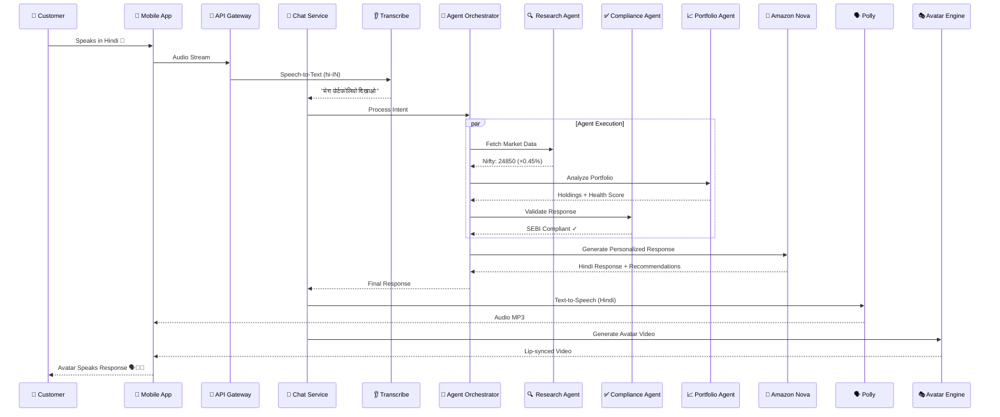
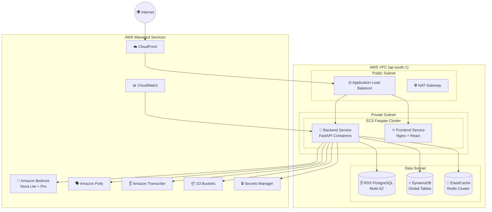

# FinSight AI — Dhan Sakhi 🧠💰

**AI-Powered Avatar-Based Multilingual Wealth Advisor**

> IDBI Innovate 2026 | Track 01: Digital Wealth Management

---

## Overview

FinSight AI (Dhan Sakhi) is an AI-powered digital wealth management application featuring a photorealistic avatar that delivers personalized, scalable wealth advisory services through natural voice conversation in 12+ Indian languages.

### Key Features

- 🗣️ **Multilingual Voice Conversation** — Hindi, Tamil, Telugu, Bengali, English + 7 more
- 👩‍💼 **AI Avatar** — Animated, lip-synced digital advisor with emotional intelligence
- 🤖 **Agentic AI** — Research, Compliance, and Portfolio agents work autonomously
- 📊 **Portfolio Dashboard** — Real-time holdings, allocation, AI health score
- 💡 **Personalized Recommendations** — SEBI-compliant, risk-profile aware
- 🎯 **Goal-Based Planning** — Retirement, home purchase, education
- 🔒 **Compliance Built-In** — Every recommendation validated before delivery

---

## System Architecture

### High-Level Architecture (Mermaid)

```mermaid
graph TB
    subgraph Client["Client Layer"]
        MA[📱 IDBI Mobile App<br/>React Native + Unity SDK]
        WA[🌐 Web App<br/>React + Tailwind]
    end

    subgraph CDN["Edge Layer"]
        CF[☁️ Amazon CloudFront<br/>Global CDN]
    end

    subgraph Gateway["API Layer"]
        AG[🔀 Amazon API Gateway<br/>REST + WebSocket]
        COG[🔐 Amazon Cognito<br/>Auth + MFA]
    end

    subgraph Compute["Application Layer"]
        LAM[⚡ AWS Lambda / ECS Fargate<br/>FastAPI Microservices]
        
        subgraph Services["Microservices"]
            SS[🎤 Speech Service]
            CS[💬 Chat Service]
            PS[📊 Portfolio Service]
            AS[🎭 Avatar Service]
            RS[💡 Recommendation Service]
        end
    end

    subgraph AI["AI / ML Layer"]
        subgraph Agents["Agentic AI Orchestrator (LangGraph)"]
            RA[🔍 Research Agent]
            CA[✅ Compliance Agent]
            PA[📈 Portfolio Agent]
            EA[⚙️ Execution Agent]
            PEA[🧠 Personalization Agent]
        end

        subgraph Models["Foundation Models"]
            NOVA[🤖 Amazon Nova Lite<br/>Conversational AI + Reasoning]
            NOVAP[🧠 Amazon Nova Pro<br/>Complex Financial Analysis]
            SM[📊 Amazon SageMaker<br/>Risk Models + Portfolio Optimization]
        end

        subgraph Speech["Speech AI"]
            POL[🗣️ Amazon Polly Neural<br/>Text-to-Speech, 12+ Languages]
            TRN[👂 Amazon Transcribe<br/>Speech-to-Text, Multilingual]
        end

        KB[📚 Bedrock Knowledge Bases<br/>Product Docs + Regulations + FAQs]
    end

    subgraph Avatar["Avatar Engine"]
        DID[🎭 D-ID / HeyGen API<br/>Photorealistic Avatar]
        LS[👄 Lip-Sync Engine<br/>Audio2Face]
        EM[😊 Emotion Detection<br/>Sentiment-Aware Expressions]
    end

    subgraph Data["Data Layer"]
        DDB[(⚡ DynamoDB<br/>Sessions + Context)]
        RDS[(🗄️ Amazon RDS<br/>Customer + Portfolio)]
        S3[(📦 Amazon S3<br/>Documents + Models)]
        RC[(🔴 ElastiCache Redis<br/>Cache + Real-time)]
    end

    subgraph External["External Integrations"]
        IDBI[🏦 IDBI Core Banking<br/>Sandbox APIs]
        MKT[📈 Market Data<br/>NSE / BSE APIs]
        MF[📊 MF APIs<br/>BSE StarMF + AMFI]
        AA[🔗 Account Aggregator<br/>Multi-bank Data]
    end

    MA --> CF
    WA --> CF
    CF --> AG
    AG --> COG
    AG --> LAM
    LAM --> Services
    CS --> Agents
    Agents --> Models
    Agents --> KB
    SS --> Speech
    AS --> Avatar
    PS --> Data
    RS --> Agents
    Services --> Data
    Services --> External
    NOVA --> RA
    NOVA --> CA
    NOVAP --> PA
```



### Data Flow Architecture (Mermaid)



### Agentic AI Architecture (Mermaid)

```mermaid
graph LR
    subgraph Input["User Input"]
        UI[🎤 Voice / Text<br/>Multilingual]
    end

    subgraph Orchestrator["LangGraph Orchestrator"]
        IC[🎯 Intent<br/>Classifier]
        CM[🧠 Context<br/>Memory]
        RP[📋 Response<br/>Planner]
    end

    subgraph Agents["Specialized Agents"]
        subgraph Research["🔍 Research Agent"]
            MKD[Market Data]
            FP[Fund Performance]
            SN[Sector News]
        end
        
        subgraph Compliance["✅ Compliance Agent"]
            SEBI[SEBI Rules]
            SUIT[Suitability Check]
            KYC[KYC Verification]
        end
        
        subgraph Portfolio["📈 Portfolio Agent"]
            HA[Holdings Analysis]
            RISK[Risk Computation]
            GAP[Gap Identification]
        end
        
        subgraph Execution["⚙️ Execution Agent"]
            SIP[SIP Orders]
            SW[Fund Switch]
            RED[Redemption]
        end
        
        subgraph Personal["🧠 Personalization Agent"]
            PREF[Preferences]
            HIST[History]
            SENT[Sentiment]
        end
    end

    subgraph LLM["Amazon Nova"]
        NL[Nova Lite<br/>Fast Conversations]
        NP[Nova Pro<br/>Deep Analysis]
    end

    subgraph Output["Response"]
        TXT[📝 Text Response]
        AUD[🔊 Audio (Polly)]
        VID[🎭 Avatar Video]
    end

    UI --> IC
    IC --> CM
    CM --> RP
    RP --> Research
    RP --> Compliance
    RP --> Portfolio
    RP --> Execution
    RP --> Personal
    Research --> NL
    Compliance --> NL
    Portfolio --> NP
    Execution --> NL
    Personal --> NL
    NL --> TXT
    NP --> TXT
    TXT --> AUD
    AUD --> VID
```

### Deployment Architecture (Mermaid)



---

## Quick Start

### Option 1: Local Development (Recommended for Demo)

#### Backend
```bash
cd backend
python -m venv venv
venv\Scripts\activate        # Windows
pip install -r requirements.txt

# Copy and configure environment
copy .env.example .env
# Edit .env with your AWS credentials (optional - works without them)

uvicorn app.main:app --reload --port 8000
```

#### Frontend
```bash
cd frontend
npm install
npm run dev
```

Open http://localhost:3000

### Option 2: Docker

```bash
docker-compose up --build
```

Open http://localhost

---

## Demo Without AWS Credentials

The app works **fully without AWS credentials** using intelligent fallback:

| Feature | With AWS | Without AWS (Demo Mode) |
|---------|----------|------------------------|
| Chat AI | Amazon Bedrock Nova Lite/Pro | Context-aware local responses |
| Voice Input | AWS Transcribe | Browser Web Speech API |
| Voice Output | Amazon Polly Neural | Browser Speech Synthesis |
| Avatar Video | D-ID API | CSS animated avatar |

This means you can demo the full experience instantly without any setup.

---

## Project Structure

```
FinSight AI/
├── backend/
│   ├── app/
│   │   ├── main.py              # FastAPI application
│   │   ├── config.py            # Configuration
│   │   ├── routers/
│   │   │   ├── chat.py          # Chat endpoints
│   │   │   ├── portfolio.py     # Portfolio endpoints
│   │   │   ├── recommendations.py
│   │   │   ├── speech.py        # TTS/STT endpoints
│   │   │   └── avatar.py        # Avatar generation
│   │   ├── services/
│   │   │   ├── llm_service.py   # Bedrock Nova + fallback
│   │   │   ├── speech_service.py
│   │   │   └── avatar_service.py
│   │   ├── data/
│   │   │   └── customers.py     # Synthetic demo data
│   │   └── models/
│   │       └── schemas.py       # Pydantic models
│   ├── requirements.txt
│   ├── Dockerfile
│   └── .env.example
├── frontend/
│   ├── src/
│   │   ├── App.jsx
│   │   ├── api.js               # API client
│   │   ├── pages/
│   │   │   ├── LandingPage.jsx  # Language + profile selection
│   │   │   ├── ChatPage.jsx     # Main conversation UI
│   │   │   └── PortfolioPage.jsx
│   │   └── components/
│   │       ├── Avatar.jsx       # Animated avatar component
│   │       └── ChatBubble.jsx
│   ├── package.json
│   ├── Dockerfile
│   └── tailwind.config.js
├── docs/
│   └── architecture.drawio      # Draw.io architecture diagram
├── docker-compose.yml
└── README.md
```

---

## API Endpoints

| Method | Endpoint | Description |
|--------|----------|-------------|
| POST | `/api/chat/message` | Send message, get AI response |
| GET | `/api/portfolio/{id}` | Get customer portfolio |
| GET | `/api/portfolio/{id}/analysis` | AI portfolio analysis |
| GET | `/api/portfolio/market` | Market data |
| POST | `/api/recommendations/generate` | Investment recommendations |
| POST | `/api/speech/tts` | Text to speech |
| POST | `/api/speech/stt` | Speech to text |
| POST | `/api/avatar/generate` | Generate avatar video |
| GET | `/api/avatar/config` | Avatar configuration |

---

## Technologies

| Layer | Technology | Purpose |
|-------|-----------|---------|
| **Frontend** | React 18, Tailwind CSS, Framer Motion | Responsive UI with animations |
| **Backend** | Python, FastAPI, LangGraph | High-performance APIs + Agent orchestration |
| **LLM** | Amazon Bedrock Nova Lite / Nova Pro | Conversational AI + Complex reasoning |
| **Speech** | Amazon Polly Neural + Transcribe | Multilingual TTS/STT (12+ languages) |
| **Avatar** | D-ID API / CSS Animation | Photorealistic talking avatar |
| **Database** | DynamoDB + RDS PostgreSQL | Sessions + Relational data |
| **Cache** | ElastiCache Redis | Real-time data + session cache |
| **CDN** | Amazon CloudFront | Low-latency global delivery |
| **Auth** | Amazon Cognito | Secure authentication + MFA |
| **Infra** | Docker, ECS Fargate, Nginx | Containerized serverless deployment |
| **CI/CD** | GitHub Actions | Automated build and deploy |

---

## Amazon Nova Model Selection

| Model | Use Case | Why |
|-------|----------|-----|
| **Nova Lite** | Real-time conversation, quick Q&A, market updates | Fast response (<2s), low cost, good multilingual support |
| **Nova Pro** | Portfolio analysis, financial planning, complex reasoning | Deeper reasoning, better accuracy for financial math |

---

## Demo Profiles

| Customer | Risk Profile | Language | Portfolio |
|----------|-------------|----------|-----------|
| Rajesh Kumar | Moderate | Hindi | ₹8.45L |
| Priya Sharma | Aggressive | English | ₹3.20L |
| Venkatesh Iyer | Conservative | Tamil | ₹45.20L |

---

## Team

**IDBI Innovate 2026 — Track 01: Digital Wealth Management**

---

## License

MIT License — Built for IDBI Innovate 2026 Hackathon
