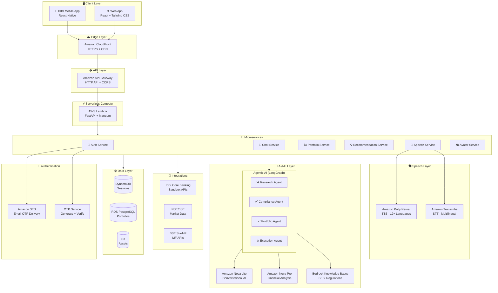
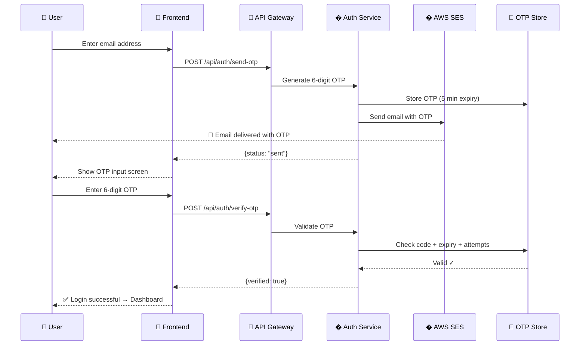
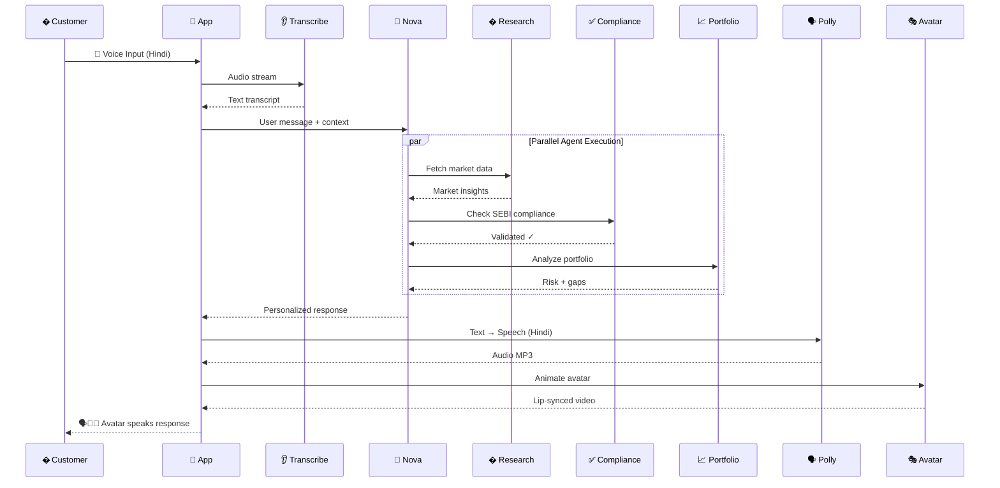
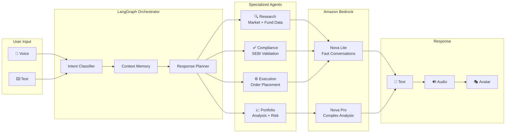
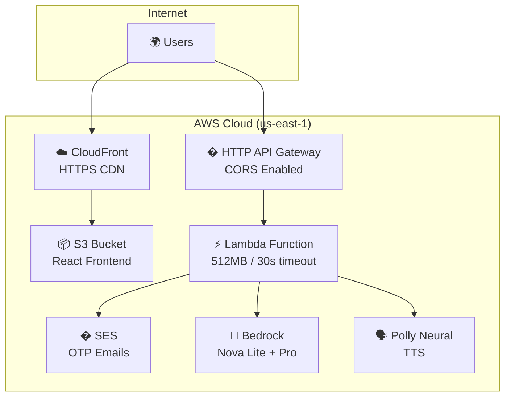

# FinSight AI — Dhan Sakhi 🧠💰

**AI-Powered Avatar-Based Multilingual Wealth Advisor**

> IDBI Innovate 2026 | Track 01: Digital Wealth Management

---

## Live Demo

| Component | URL |
|-----------|-----|
| **Frontend App (HTTPS)** | [https://dgmfyimmjupnd.cloudfront.net](https://dgmfyimmjupnd.cloudfront.net) |
| **Backend API** | [https://z1go1ry6zi.execute-api.us-east-1.amazonaws.com](https://z1go1ry6zi.execute-api.us-east-1.amazonaws.com) |
| **Health Check** | [https://z1go1ry6zi.execute-api.us-east-1.amazonaws.com/health](https://z1go1ry6zi.execute-api.us-east-1.amazonaws.com/health) |

---

## Overview

FinSight AI (Dhan Sakhi) is an AI-powered digital wealth management application featuring a photorealistic avatar that delivers personalized, scalable wealth advisory services through natural voice conversation in 12+ Indian languages.

### Key Features

- � **Email OTP Authentication** — Real email-based OTP for secure login via AWS SES
- �🗣️ **Multilingual Voice Conversation** — Hindi, Tamil, Telugu, Bengali, English + 7 more
- 👩‍💼 **AI Avatar** — Animated, lip-synced digital advisor with emotional intelligence
- 🤖 **Agentic AI** — Research, Compliance, and Portfolio agents work autonomously
- 📊 **Portfolio Dashboard** — Real-time holdings, allocation, AI health score
- 💡 **Personalized Recommendations** — SEBI-compliant, risk-profile aware
- 🎯 **Goal-Based Planning** — Retirement, home purchase, education
- � **Voice Controls** — Play/Pause/Stop voice output at any time

---

## System Architecture

### High-Level Architecture



### Authentication Flow (Email OTP)



### Chat Conversation Flow



### Agentic AI Architecture



### Deployment Architecture



---

## Quick Start

### Option 1: Use Live Demo

Visit https://dgmfyimmjupnd.cloudfront.net — login with your email to receive OTP.

### Option 2: Local Development

#### Backend
```bash
cd backend
python -m venv venv
venv\Scripts\activate
pip install -r requirements.txt
copy .env.example .env
uvicorn app.main:app --reload --port 8000
```

#### Frontend
```bash
cd frontend
npm install
npm run dev
```

Open http://localhost:3000

---

## Project Structure

```
FinSight AI/
├── backend/
│   ├── app/
│   │   ├── main.py              # FastAPI application
│   │   ├── config.py            # Configuration
│   │   ├── routers/
│   │   │   ├── auth.py          # Email OTP authentication
│   │   │   ├── chat.py          # AI chat with agents
│   │   │   ├── portfolio.py     # Portfolio management
│   │   │   ├── recommendations.py
│   │   │   ├── speech.py        # TTS/STT
│   │   │   └── avatar.py        # Avatar generation
│   │   ├── services/
│   │   │   ├── llm_service.py   # Bedrock Nova + fallback
│   │   │   ├── speech_service.py
│   │   │   └── avatar_service.py
│   │   └── data/
│   │       └── customers.py     # Synthetic demo data
│   ├── lambda_handler.py        # AWS Lambda entry point
│   ├── requirements.txt
│   └── Dockerfile
├── frontend/
│   ├── src/
│   │   ├── App.jsx              # Route management
│   │   ├── api.js               # API client
│   │   ├── pages/
│   │   │   ├── LoginPage.jsx    # Email OTP login
│   │   │   ├── LandingPage.jsx  # Language + profile
│   │   │   ├── ChatPage.jsx     # Avatar conversation
│   │   │   └── PortfolioPage.jsx
│   │   └── components/
│   │       ├── Avatar.jsx       # Animated avatar
│   │       └── ChatBubble.jsx
│   ├── package.json
│   └── tailwind.config.js
├── docs/
│   ├── architecture.drawio
│   ├── process-flow.drawio
│   ├── use-case.drawio
│   ├── wireframes.drawio
│   └── prototype-snapshots.drawio
├── infra/
│   └── template.yaml           # SAM template
└── docker-compose.yml
```

---

## API Endpoints

| Method | Endpoint | Description |
|--------|----------|-------------|
| POST | `/api/auth/send-otp` | Send OTP to email via SES |
| POST | `/api/auth/verify-otp` | Verify OTP code |
| POST | `/api/chat/message` | AI chat with agents |
| GET | `/api/portfolio/{id}` | Customer portfolio |
| GET | `/api/portfolio/{id}/analysis` | AI health score |
| POST | `/api/recommendations/generate` | Investment advice |
| POST | `/api/speech/tts` | Text to speech |
| GET | `/api/avatar/config` | Avatar settings |
| GET | `/health` | Service health |

---

## Technologies

| Layer | Technology | Purpose |
|-------|-----------|---------|
| **Frontend** | React 18, Tailwind CSS, Framer Motion | UI with IDBI brand colors |
| **Backend** | Python, FastAPI, LangGraph | API + Agent orchestration |
| **Auth** | AWS SES + OTP | Email-based secure authentication |
| **LLM** | Amazon Bedrock Nova Lite/Pro | Conversational AI |
| **Speech** | Amazon Polly Neural + Transcribe | Multilingual TTS/STT |
| **Avatar** | D-ID API / CSS Animation | Talking avatar |
| **Hosting** | S3 + CloudFront (HTTPS) | Static frontend |
| **Compute** | AWS Lambda + API Gateway | Serverless backend |
| **Database** | DynamoDB | Session storage |

---

## Color Scheme (IDBI Bank Brand)

| Color | Hex | Usage |
|-------|-----|-------|
| IDBI Teal | `#00857C` | Primary, headers, trust elements |
| IDBI Orange | `#E87722` | Accent, CTAs, highlights, buttons |
| Dark Teal | `#004D47` | Backgrounds, gradients |
| Light Teal | `#E6F5F3` | Hover states, cards |
| Light Orange | `#FEF3E8` | Alerts, notifications |

---

## Security

- Email-based OTP authentication (no passwords stored)
- OTP expires after 5 minutes
- Maximum 5 verification attempts per OTP
- HTTPS via CloudFront
- CORS restricted on API Gateway
- No sensitive data in frontend code
- AWS IAM roles with least privilege

---

## Submission Links

| Item | Link |
|------|------|
| **GitHub Repo** | [https://github.com/dineshrajdhanapathyDD/FinSight-AI](https://github.com/dineshrajdhanapathyDD/FinSight-AI) |
| **Live Product** | [https://dgmfyimmjupnd.cloudfront.net](https://dgmfyimmjupnd.cloudfront.net) |
| **API Endpoint** | [https://z1go1ry6zi.execute-api.us-east-1.amazonaws.com](https://z1go1ry6zi.execute-api.us-east-1.amazonaws.com) |
| **Demo Video** | _To be added_ |

---

## Team

**IDBI Innovate 2026 — Track 01: Digital Wealth Management**

---

## License

MIT License — Built for IDBI Innovate 2026 Hackathon
